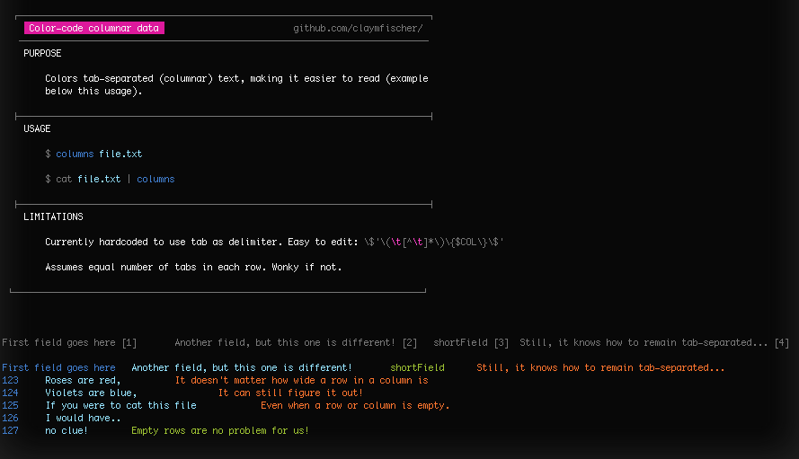

# Color-code columnar data

This is a utility that helps make tab-separated data easier to view on the command line. Accepts `stdin`, you'll need to provide the argument `stdin` instead of `file.tsv`. There are color legends both at the top at bottom, allowing you to pipe to `head` or `tail`.

`$ columns file.tsv`
`$ cat file.tsv | columns stdin`

---

This is what it looks like when viewing columnar-data on the command line. It can be difficult to ascertain what belongs to which column.

`$ cat example.tsv`

By passing through a simple grep loop, we can colorize our column output.

`$ columns example.tsv`

---

## Comparing columns

Simply add any [integer] arguments after the filename to highlight those columns for easy comparisons.

`$ cat example.tsv | columns stdin 3 6 9 10 17 25`

---

Another example.

